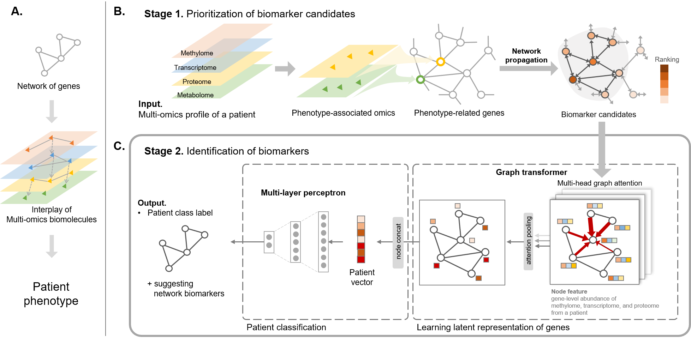

# GOAT: Gene-level biomarker discovery from multi-Omics data using graph ATtention neural network for eosinophilic asthma subtype 
  
We propose a novel deep graph attention model for biomarker discovery for the asthma subtype by incorporating complex interactions between biomolecules and capturing key biomarker candidates using the attention mechanism.

## Setup
### Create docker image
You can build a docker image from Dockerfile.
~~~
# Pull base image from docker hub
docker pull dabinjeong/cuda:10.1-cudnn7-devel-ubuntu18.04

# Build docker image
docker build --tag biomarker:0.1.1 .
~~~
You can also download the docker image from Docker hub (https://hub.docker.com/repository/docker/dabinjeong/biomarker/general).
~~~
docker pull dabinjeong/biomarker:0.1.1
~~~
### Install workflow manager: Nextflow
~~~
conda create -n biomarker python=3.9
conda activate biomarker
conda install -c bioconda nextflow=21.04.0
~~~

## Run
~~~
nextflow run biomarker_discovery.nf -c pipeline.config -with-docker biomarker:0.1.1
~~~


## Comparitive analysis
For comparative analysis, please refer to the following repository, <a href="https://github.com/DabinJeong/Comparative_analysis_multi-omics_biomarker"> comparative_analysis_multi-omics_biomarker</a>.


## Citation
```
@article{jeong2023goat,
  title={GOAT: Gene-level biomarker discovery from multi-Omics data using graph ATtention neural network for eosinophilic asthma subtype},
  author={Jeong, Dabin and Koo, Bonil and Oh, Minsik and Kim, Tae-Bum and Kim, Sun},
  journal={Bioinformatics},
  volume={39},
  number={10},
  pages={btad582},
  year={2023},
  publisher={Oxford University Press}
}
```
