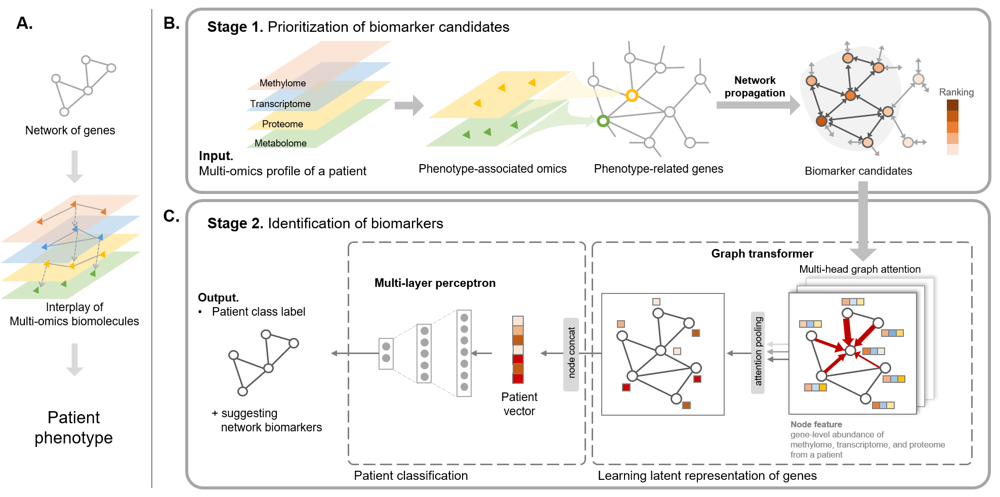

# Table of contents
* [Project description](#Project-description)
* [Setup](#setup)
* [Run](#run)

# Project description
  
We propose a novel deep graph attention model for biomarker discovery for the asthma subtype by incorporating complex interactions between biomolecules and capturing key biomarker candidates using the attention mechanism.

# Setup
## Build docker image
~~~
docker build --tag biomarker:0.1.1 .
~~~
## Install workflow manager: Nextflow
~~~
conda create -n biomarker python=3.9
conda activate biomarker
conda install -c bioconda nextflow=21.04.0
~~~

# Run
~~~
nextflow run biomarker_discovery.nf -c pipeline.config -with-docker biomarker:0.1.1
~~~

# Comparitive analysis
For comparative analysis, please refer to the following repository, <a href="https://github.com/DabinJeong/Comparative_analysis_multi-omics_biomarker"> comparative_analysis_multi-omics_biomarker</a>
